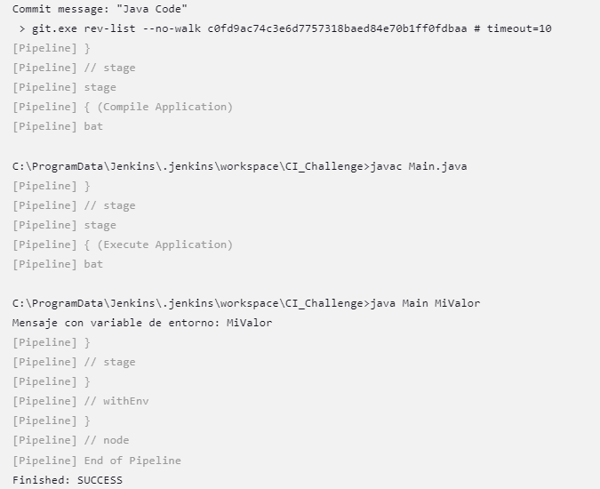

# CI_Challenge_Juan_D_Sierra

## Project Description

This project revolves around the utilization of the Main.java code within a Jenkins pipeline. The primary objective is to harness the capabilities of environment variables in the Java code. By seamlessly integrating these variables into the Jenkins pipeline, the project aims to achieve dynamic and automated updates based on the environment variable values.

## How It Works - Java Code

1. **Code Setup:** The `Main.java` code is crafted to interact with environment variables. The relevant environment variable is employed as a dynamic placeholder. This is an example of the source code:

```java
String variableValue = System.getenv("variableName");
System.out.println("Mensaje con variable de entorno: " + variableValue);
```


## Step-by-Step Guide to Integrating Continuous Integration

1. **Setting Up the Repository:**
   Now that the repository is prepared, it's time to incorporate Continuous Integration (CI) into the workflow. Follow these steps to seamlessly integrate CI into your project:

2. **Jenkins Project Creation:**
   Begin by establishing a new project within Jenkins. This is the cornerstone of our CI setup. Here's what you need to do:

3. **Linking the Repository:**
   Link the Jenkins project with the repository you've created. This connection is crucial for automating the CI pipeline. Follow these steps:

4. **Configuring Automated Actions:**
   With the repository and Jenkins project synchronized, it's time to configure the automated actions that will occur every time a commit is pushed to the remote repository's main branch:

5. **Cloning and Fetching:**
   The first step is to clone the repository and fetch the latest version of the source code. This ensures that the CI pipeline operates with the most up-to-date codebase.

6. **Compiling the Application:**
   To ensure code integrity, create a dedicated stage in the pipeline for compiling the application. Here's how to set it up:
```jenkins
pipeline {
    agent any
    
    environment {
        variableName = 'MiValor' // Define el valor deseado para la variable de entorno
    }
    
    stages {
        stage('Clone and Fetch') {
            steps {
                // Clone the repository and fetch the latest code
                git branch: 'main', url: 'https://github.com/juandiego-sierra-globant/CI_Challenge_Juan_D_Sierra.git'
            }
        }
        
        stage('Compile Application') {
            steps {
                // Compile the Java application
                bat(script: 'javac Main.java', returnStatus: true)
        
            }
        }
        
        stage('Execute Application') {
            steps {
                 // Execute the Java application with the environment variable
                bat "java Main %variableName%"
            }
        }
    }
}

```

7. **Executing the Application:**
   After successful compilation, proceed to execute the application. It's essential to set this stage correctly, including passing any necessary parameters via the command line to ensure flawless code execution.

## Result

